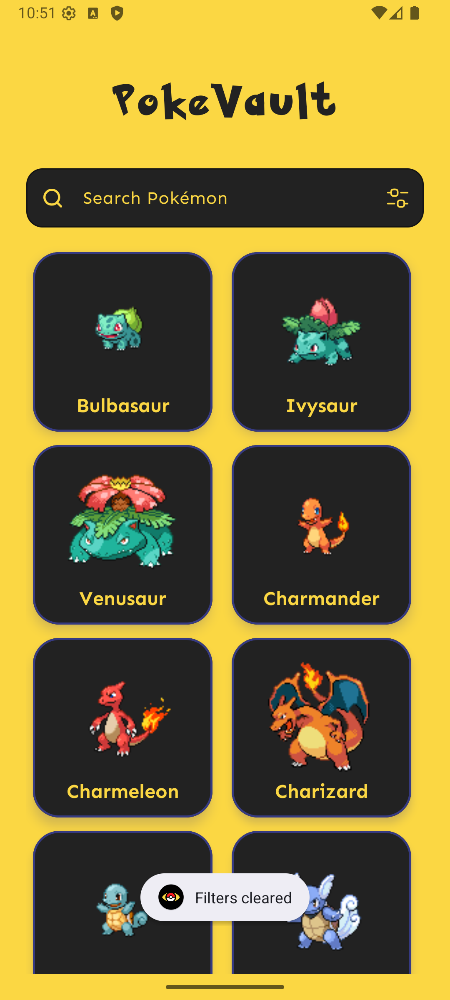
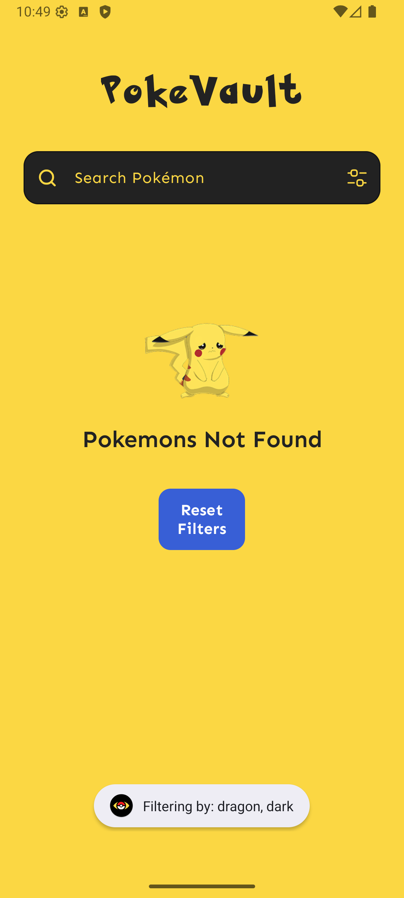
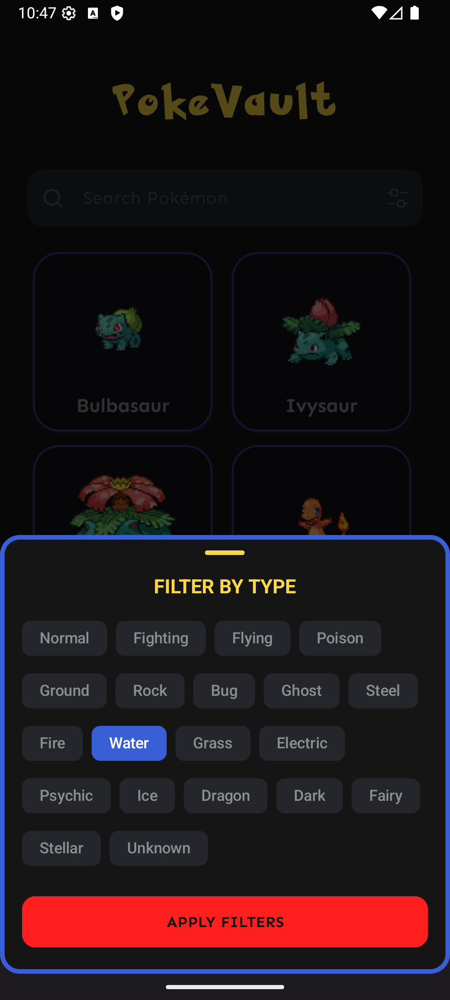

# 🐾 PokeVault

PokeVault is an Android application for exploring Pokémon with **search, type filtering, and offline support**.  
It is built with modern Android tools and follows **clean architecture** principles.

## Features

- **Search by name** — quickly find your favorite Pokémon  
- **Filter by type** — view only Water, Fire, Grass, etc.  
- **Caching after first launch** — data is stored locally with Room for **offline use**  
- **Light & Dark mode** with Material Design  
- **Splash screen** on first launch (skipped afterwards)  
- **Custom app icon**  
- **"No Pokémon Found"** message with a reset button when no matches exist  
- Tested on multiple Android versions on **both physical and virtual devices**

## Tech Stack

- **Kotlin**
- **Room** — local database and caching
- **Hilt** — dependency injection
- **Retrofit** — API requests
- **SQL** — data queries
- **RecyclerView + Adapters** — Pokémon list UI
- **Fragments** — modular UI navigation
- **Coil** — efficient image loading and caching
- **Material Design** components
- **XML layouts** for flexible UI

## Project Structure


├── data

├── domain

├── presentation

└── di       

## Screenshots

<table>
  <tr>
    <td></td>
    <td></td>
    <td></td>
    <td></td>
  </tr>
</table>

## How to Run

1. Clone the repo:
   ```bash
   git clone https://github.com/The-uncanny-valley/PokeVault.git ```
2. Open the project in Android Studio
3. Sync Gradle dependencies
4. Run on an emulator or physical device

## Tested On

- Physical devices: Android 8, 12, 13
- Virtual devices: Android 15, 16

## Future Improvements

- Add Pokémon details screen
- Show abilities, stats, moves
- Add favorites functionality
- Optimize preloading and caching
   
